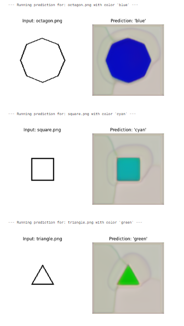
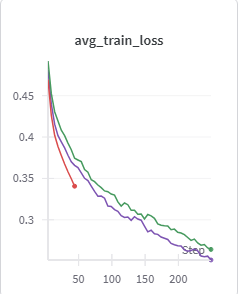
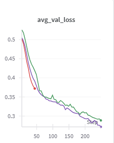

#Conditional Polygon Colorization

This project implements a conditional UNet from scratch in PyTorch to colorize polygon images based on a text input. The model takes a grayscale image of a polygon and a color name (e.g., "blue") and outputs the same polygon filled with the specified color.

**Submitted by:** Priyanshu Mohanty

---

## Final Results

The trained model successfully learned to segment various polygon shapes and apply the specified color condition. The following images were generated by the final inference notebook.

---

## 1. Hyperparameters

The final model was trained using a specific set of hyperparameters, logged and tracked using Weights & Biases.

| Hyperparameter  | Value             | Rationale                                                                                             |
|-----------------|-------------------|-------------------------------------------------------------------------------------------------------|
| **Epochs**      | 50                | Provided a good balance between training time and convergence. Loss curves showed stability by this point. |
| **Batch Size**  | 16                | A standard size that fit comfortably into the GPU memory and provided stable gradient updates.         |
| **Learning Rate** | `1e-4`              | A common and effective starting rate for the Adam optimizer, providing steady convergence without instability. |
| **Optimizer**   | Adam              | A robust, general-purpose optimizer that is well-suited for most deep learning vision tasks.            |
| **Loss Function** | L1 Loss (MAE)     | Chosen over MSE as it's less sensitive to large errors and tends to produce sharper image outputs. |
| **Image Size**  | 128x128           | A standard resolution for fast training that retains sufficient detail for the given shapes.       |
| **Device**      | NVIDIA P100 (Kaggle) | Utilized free GPU resources for accelerated training.                                                 |

---

## 2. Architecture

The model is a **Conditional UNet** built from scratch in PyTorch.

*   **UNet Structure:** It uses a classic encoder-decoder architecture with skip connections.
    *   **Encoder:** Consists of 4 downsampling blocks. Each block contains a `MaxPool2d` layer followed by a `DoubleConv` module (two `Conv2d` -> `BatchNorm2d` -> `ReLU` sequences).
    *   **Decoder:** Consists of 4 symmetric upsampling blocks. Each block uses bilinear upsampling (`nn.Upsample`) to increase feature map resolution, concatenates the result with the corresponding skip connection from the encoder path, and passes it through a `DoubleConv` module.
    *   **Output:** A final 1x1 convolution (`OutConv`) maps the feature channels to the 3 output channels (RGB), followed by a `Sigmoid` activation to scale the output to a `[0, 1]` pixel range.

*   **Conditioning Mechanism:** The text-based color name is the condition that guides the image generation.
    1.  A vocabulary of all unique color names from the dataset is created, and each color is mapped to an integer index.
    2.  An `nn.Embedding` layer converts the color's index into a dense, learnable vector (`embedding_dim=32`).
    3.  This color vector is injected into the model at the **bottleneck** (the lowest point of the "U").
    4.  The image features from the encoder are globally averaged, concatenated with the color embedding vector, passed through a `nn.Linear` layer to match dimensions, and finally added back to the original bottleneck feature map. This allows the color information to influence the entire upsampling and reconstruction process.

---

## 3. Training Dynamics

*   **Loss Curves:**

    
    

    The training and validation loss curves show a healthy learning progression. The validation loss consistently decreased alongside the training loss, indicating that the model generalized well to unseen data without significant overfitting. The model checkpointing strategy correctly saved the model at the epoch with the lowest validation loss.

*   **Qualitative Output Trends (Successes):**
    *   The model proved highly effective at segmenting the polygon shape from the background.
    *   The color conditioning mechanism worked perfectly, correctly interpreting the text label and applying the appropriate color fill.
    *   The model demonstrated generalization across different shapes and colors present in the validation set.

*   **Typical Failure Modes & Fixes Attempted:**
    *   **Initial `DataLoader` Errors:** The most significant initial challenge was a `RuntimeError` related to `DataLoader` workers (`num_workers > 0`) in the Kaggle notebook environment.
        *   **Fix:** The issue was resolved by setting `num_workers=0`. This forces data loading onto the main process, which is a standard and stable solution for this specific environment, albeit with a minor trade-off in data loading speed.
    *   **Blurry Edges:** The generated images exhibit soft, slightly blurred edges. This is a well-known artifact of using pixel-wise loss functions like L1, which average errors and thus penalize overly sharp transitions.
    *   **Background Artifacts:** The model produces faint color smudges in the background instead of a pure white canvas. This is likely due to the conditioning information "leaking" during the decoder's reconstruction process.

---

## 4. Key Learnings & Future Work

*   **Environment-Specific Debugging:** A key takeaway was the importance of debugging issues specific to the execution environment, such as the `DataLoader` multiprocessing error in Kaggle notebooks.
*   **Conditioning is Powerful:** Injecting conditional information (like a color embedding) at the bottleneck is a simple yet highly effective technique for guiding a generative model's output.
*   **Code Structure:** Separating the project into a training notebook and a dedicated inference notebook is crucial for clarity, reproducibility, and demonstrating a portable final model artifact.

**Future Improvements:**
*   **Data Augmentation:** Implement paired augmentations (e.g., random rotations, scaling) on both the input and output images to enhance model robustness.
*   **Advanced Loss Functions:** To achieve sharper edges, one could explore a combination of L1 loss with an adversarial loss (from a GAN discriminator) or a perceptual loss (like VGG loss), which are better at capturing high-frequency details.
*   **Refined Conditioning:** Experiment with more advanced conditioning mechanisms like FiLM (Feature-wise Linear Modulation) layers, which can apply affine transformations to feature maps throughout the decoder for more fine-grained control.
